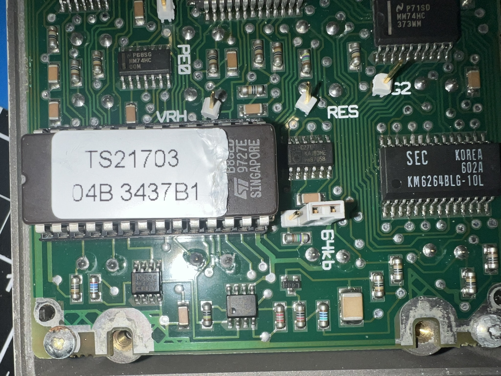

# Nokia TC21700 service terminal


This is something I picked up for cheap as a surplus item which I had no prior knowledge of, other than the fact that it says Nokia on it and came in a nice-looking pleather case (not pictured: the pleather case. But it is nice). Upon doing some research, I found out it's known as the "service terminal" or "TC21700", and appears to be used for programming Nokia RF equipment. I believe it dates from the early-to-late 90s, from the random PDFs I was able to find:

* [DMR-38](PDFs/DMR-38.pdf) ([source](https://www.scribd.com/doc/41666529/Nokia-DMR38-1)): This seems to be a microwave repeater system commissioned by the Australian telecom Optus in the early 90s, maybe for their PSTN network? Towards the end of the document there are multiple pages describing how the system's parameters are configured using the terminal.
* [DMR-7000](PDFs/DMR-7000.pdf) ([source](https://www.scribd.com/document/40699852/DMR-7000)): Perhaps another microwave repeater system? Also towards the end it has a more complete guide around the data terminal (including a very low-res picture of it with the main units).

The unit itself is very nondescript. It has a HD44780-type 20x4 LCD display, plus a very nice keypad on the front. On the top is a single DB15 connector and a power switch.
**Important**: There is also an internal 7.2v NiCd battery. The one on mine was in a sorry state, but keep in mind it's something you should remove as soon as possible.

According to the manuals above it communicates over RS485 (full duplex), which I have confirmed.

Powering up is easy, as taking it apart reveals push-down battery terminals. You can supply ~7.5v to the unit through those (keep in mind it has battery detection circuitry so if the voltage is too low it will show an error on screen). I have not yet figured out how to supply power through the DE15 connector, it's possible that it won't power on unless a battery is present.


**Important**: Do not power it up through the +5V pin, as it won't turn on.

## Labels

On the back of the unit there is a label with TC21700 plus another one that reads TS21703. It appears that TS21703 is the specific software for the unit and TC21700 is the generic model number, as you will see later on. I haven't been able to locate any other software versions or types, so maybe this was the only one.


There are also some additional labels on the PCB - these look like dates of manufacture and test, the 50th week of 1997.


Lastly we have the same TS21703 label on the EPROM:


## Hardware Specifications


* Main MCU: Toshiba TMB68HC11AT ([datasheet](PDFs/TMP68HC11E9.pdf)) - Motorola 6800-based microcontroller with 256 bytes of RAM, 512 bytes of EEPROM and no ROM.
* ROM: ST M27C512 (64k * 8) *[ROM dump here](TS21703.bin)*
* SRAM: Samsung KM6264BLG-10L (8k * 8)

### DE15 Pinout


```
--------------------------
| 1  2  3  4  5  6  7  8 |
\  9 10 11 12 13 14 15 /
 ----------------------

Shield: GND
1: VCC/+5V?
2: Unknown
3: VCC/+5V?
4/5: RS485 RX +/- (data to terminal)
6: GND
7/8: RS485 TX +/- (data from terminal)
9: N/C
10: N/C
11: Unknown
12: N/C
13: Battery level sense?
14: GND
15: Unknown (to MCU PC0 pin)
```